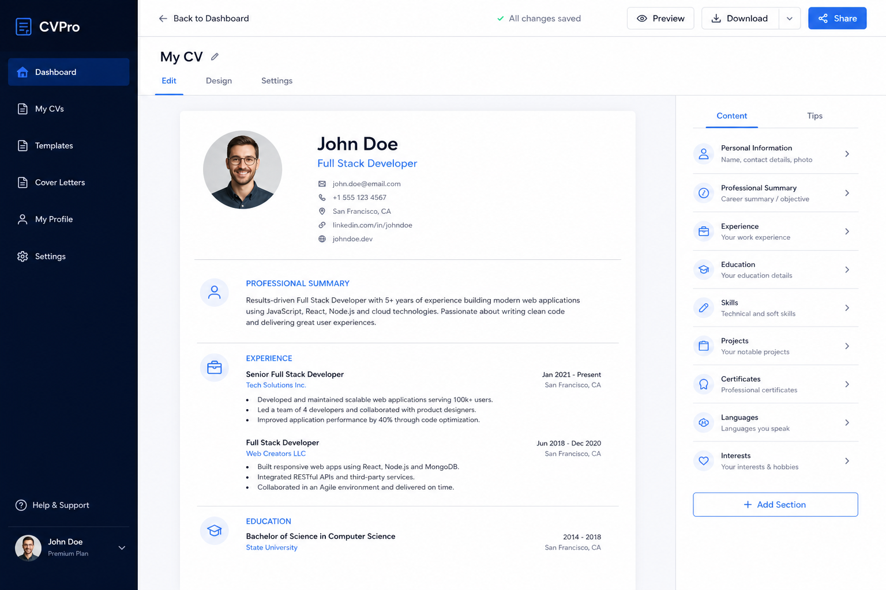
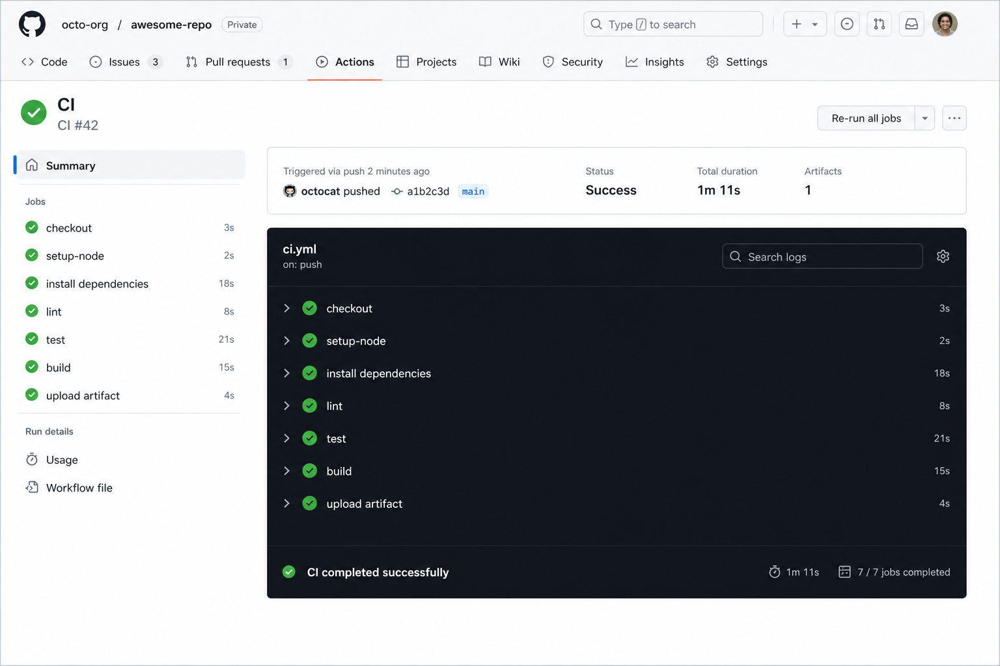
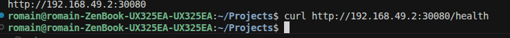

# Projet DevOps ECE 2026 — CV Web Application

**Groupe SI03** · ECE Paris · Deadline : 23 décembre 2025

Application web Node.js complète : CV en ligne, compteur Redis, API REST documentée (Swagger), commentaires, CI/CD GitHub Actions + GitLab CI, IaC Vagrant/Ansible, Docker Hub, Kubernetes (Minikube).

> Checklist complète : [`CHECKLIST-RENDU.md`](CHECKLIST-RENDU.md)

---

## ⚠️ Éléments à finaliser manuellement

| Élément | Statut | Action restante |
|---------|--------|-----------------|
| Dépôt GitHub **privé** | À faire | Settings → Private + inviter l’enseignant |
| Code poussé sur `main` | Commit local à pousser | `git push origin main` |
| Docker Hub | ✅ `romainmlt/devops-cv-webapp:latest` | — |
| Kubernetes Minikube | ✅ cluster + pods Running | capture PNG optionnelle |
| IaC Vagrant | ⚠️ code OK, VM non exécutée | VirtualBox / Secure Boot — voir § IaC |
| Render live | ✅ déployé (Docker, commit `17249a9`) | https://ece-devops-2026-spring.onrender.com |
| CI GitHub Actions | Après push | workflows `Projet — *` |

Credentials locaux : copier `.env.example` → `.env` (ignoré par git). Sync secrets : `bash scripts/sync-github-secrets.sh` (nécessite `gh`).

---

## 1. Travail réalisé

| Code | Sujet | Points | Statut |
|------|--------|--------|--------|
| APP | Contenu web simple (CV) | +2 | ✅ code |
| APP | App enrichie + tests auto | +4 | ✅ 19 tests (`make test`) |
| CICD | CI/CD + déploiement | +3 | ✅ code — déploiement après secrets |
| IAC | Vagrant + Ansible | +5 | ✅ code — VM bloquée (VirtualBox), playbooks documentés |
| KUB | Kubernetes Minikube | +3 | ✅ exécuté (`kubectl get all`, NodePort 30080) |
| BNS | Bonus (×0,5) | +0,5 chacun | ✅ voir ci-dessous |

### Fonctionnalités application

- Page **CV** responsive (thème sombre, stats live)
- Compteur de vues Redis (`cv:views`)
- API `/user` : `GET` liste, `POST`, `GET/:id`, `PUT`, `DELETE`
- API `/comments` : lecture / écriture
- API `/api/stats` : statistiques globales
- **`/health`** : santé app + Redis + uptime
- **Swagger UI** : `/api-docs` (OpenAPI 3)
- Basé sur le lab `04.continuous-testing/lab` — **tous les TODO complétés** + extensions

### Bonus réalisés

| Bonus | Détail |
|-------|--------|
| Commentaires | Section interactive sur le CV |
| Swagger | `swagger-ui-express` + `conf/openapi.yaml` |
| GitLab CI | `.gitlab-ci.yml` (pipeline miroir) |
| API étendue | CRUD utilisateur + stats |
| Makefile | `make test`, `docker-build`, `k8s-apply` |
| docker-compose | App + Redis en un commande |
| Script preuves | `scripts/capture-evidence.sh` |

---

## 2. Screenshots

### Page CV (local)



### Pipeline CI (GitHub Actions)



> Refaire cette capture après push : workflows **`Projet — CI CV Webapp`** (racine `.github/workflows/projet-ci.yml`).

### Health check (capture terminal)

```json
{"status":"ok","app":"up","redis":true,"version":"1.0.0","uptime":2.02}
```

Fichier : [`screenshots/terminal/health.json`](screenshots/terminal/health.json)

### Tests automatisés

```
19 passing (53ms)
```

Fichier : [`screenshots/terminal/npm-test.txt`](screenshots/terminal/npm-test.txt)

### Build Docker & Hub

Image : `romainmlt/devops-cv-webapp:latest` — [`screenshots/terminal/docker-build.txt`](screenshots/terminal/docker-build.txt)

### Kubernetes (Minikube — exécuté)

Sortie `kubectl get all` : [`screenshots/terminal/kubectl-get-all.txt`](screenshots/terminal/kubectl-get-all.txt)

```text
deployment.apps/cv-webapp   2/2     2            2
deployment.apps/redis       1/1     1            1
```

Accès : `minikube service cv-webapp-service --url` (souvent `http://192.168.49.2:30080`)



Health K8s : [`screenshots/terminal/k8s-health.json`](screenshots/terminal/k8s-health.json)

### IaC (Vagrant / Ansible)

> **Contrainte :** VirtualBox (`vboxdrv`) ne charge pas sur la machine de rendu (Secure Boot / modules noyau).  
> **Livré :** `iac/Vagrantfile`, playbooks Ansible (Node, Redis, systemd, health check).  
> **Preuve alternative :** [`screenshots/terminal/ansible-syntax-check.txt`](screenshots/terminal/ansible-syntax-check.txt)

Relance sur machine avec VirtualBox OK :

```bash
cd iac && vagrant up && curl http://localhost:3000/health
```

---

## 3. Liens plateformes

| Outil | Lien | Note |
|-------|------|------|
| **Dépôt GitHub** | https://github.com/Rqbln/ece-devops-2026-spring | Passer en **privé** avant rendu |
| **Docker Hub** | https://hub.docker.com/r/romainmlt/devops-cv-webapp | ✅ image poussée |
| **Image Docker** | `docker pull romainmlt/devops-cv-webapp:latest` | — |
| **Render** | https://ece-devops-2026-spring.onrender.com | ✅ homepage OK (Redis cloud non configuré → `/health` partiel) |
| **Swagger (local)** | http://localhost:3000/api-docs | — |
| **GitHub Actions** | https://github.com/Rqbln/ece-devops-2026-spring/actions | Workflows `Projet — *` |

---

## 4. Auteurs

| Étudiant | Groupe | GitHub |
|----------|--------|--------|
| **Romain Martin** | SI03 | @Rqbln |

*(Ajouter ici les coéquipiers réels du groupe SI03 si le projet est en équipe.)*

---

## 5. Structure du projet

```
.github/workflows/          # ← exécutés par GitHub (projet-ci.yml, projet-cd.yml, …)
rendus/projet/
├── .github/workflows/     # référence (voir README dans ce dossier)
├── .env.example / .env      # credentials locaux (non commité)
├── .gitlab-ci.yml         # Bonus GitLab
├── webapp/                Application Node.js
├── iac/                   Vagrant + Ansible
├── image/                 Manifests Kubernetes
├── scripts/               capture-evidence.sh
├── screenshots/           Images + sorties terminal
├── Makefile
└── README.md
```

---

## 6. Installation

### Prérequis

Node.js 18+, Redis 7+, Docker, (optionnel) Vagrant, Minikube, kubectl

### Rapide

```bash
cd rendus/projet
make install
make test      # démarre Redis via Docker si besoin
make start     # http://localhost:3000
```

### Docker Compose

```bash
cd rendus/projet/webapp
docker compose up --build
```

---

## 7. Utilisation

| Action | Commande |
|--------|----------|
| CV | http://localhost:3000 |
| Health | `curl localhost:3000/health` |
| Stats | `curl localhost:3000/api/stats` |
| Swagger | http://localhost:3000/api-docs |
| Créer user | `curl -X POST localhost:3000/user -H 'Content-Type: application/json' -d '{"username":"romain","firstname":"Romain","lastname":"Martin"}'` |
| Commentaire | `curl -X POST localhost:3000/comments -H 'Content-Type: application/json' -d '{"author":"Prof","text":"Excellent projet !"}'` |

### Docker Hub

```bash
cp .env.example .env   # puis remplir DOCKERHUB_TOKEN
make docker-build
make docker-push       # ou : docker login && docker push
make env-check
```

### Vagrant + Ansible

```bash
cd rendus/projet/iac
vagrant up
curl http://localhost:3000/health
vagrant ssh -c "systemctl status cv-webapp"
```

### Kubernetes (Minikube)

```bash
minikube start
eval $(minikube docker-env)
cd rendus/projet/webapp && docker build -t devops-cv-webapp:local .
# Modifier image/deployment.yaml → image: devops-cv-webapp:local
make k8s-apply
kubectl get all
minikube service cv-webapp-service --url
# Accès NodePort : http://localhost:30080
```

---

## 8. Tests

```bash
make test
# ou
cd webapp && REDIS_HOST=127.0.0.1 npm test
```

Couverture :

- Configuration JSON
- Connexion Redis
- Controller user (CRUD, doublons)
- API HTTP (CV, health, comments, stats, Swagger)
- DELETE /user

Générer les preuves terminal :

```bash
make capture
```

---

## 9. CI/CD

### GitHub Actions (racine du dépôt)

| Workflow | Fichier | Rôle |
|----------|---------|------|
| Projet — CI | `.github/workflows/projet-ci.yml` | ESLint + tests (Redis service) |
| Projet — CD | `.github/workflows/projet-cd.yml` | Build & push Docker Hub + Render |
| Projet — K8s | `.github/workflows/projet-k8s-validate.yml` | `kubectl apply --dry-run` |

### Secrets GitHub

Copier depuis `.env` :

```bash
bash scripts/sync-github-secrets.sh   # gh auth login requis
```

Noms : `DOCKERHUB_USERNAME`, `DOCKERHUB_TOKEN`, `RENDER_SERVICE_ID`, `RENDER_API_KEY` (Render optionnel).

### GitLab CI (bonus)

Fichier `.gitlab-ci.yml` — stages `test` et `build`.

---

## 10. Rendu & évaluation

1. Dépôt **PRIVÉ** + invitation compte enseignant GitHub
2. Email :

   - **Objet :** `ECE - DevOps project - MARTIN Romain - SI03`
   - **Corps :** lien repo + auteurs + numéro de groupe

---

## 11. Informations complémentaires

- Personnalisation du CV : `webapp/src/index.js` → objet `profile`
- OpenAPI : `webapp/conf/openapi.yaml`
- Historique de commits suggéré : `app` → `iac` → `docker` → `k8s` → `ci` → `docs`
- Projet réalisé dans le cadre du cours DevOps ECE 2026 Spring

### Alternatives si VirtualBox / Minikube indisponibles

| Composant | Alternative documentée |
|-----------|------------------------|
| IaC | Conserver playbooks + capture `ansible-playbook --check` ; mentionner contrainte matérielle |
| K8s | `kubectl apply --dry-run=client -f image/` (CI `projet-k8s-validate.yml`) |
| Redis cloud Render | Homepage seule sans DB payante (consigne cours) |
